# 分配员手册

## 适用对象

适用于中心面板中的分配员。

## 你负责什么

分配员负责平台日常运行，不负责底层系统开发。

分配员的主要职责：

1. 管理服务器接入状态。
2. 分配和回收容器。
3. 调整容器资源。
4. 管理镜像与环境备份。
5. 监督 GPU 用量与额度。
6. 协助用户解决日常使用问题。

## 你不应直接做什么

1. 直接修改宿主机 Docker 底层配置。
2. 随意进入宿主机手工篡改受管容器。
3. 在未确认数据位置时直接重建或删除容器。
4. 不留记录地调整用户额度和资源。

!!! warning "重要边界"
    分配员应优先通过网页面板完成操作。  
    删除、重建、额度调整这类关键操作应确保能在日志中追踪。

## 界面总览

后台是单页仪表盘，左侧导航负责切换主要栏目。

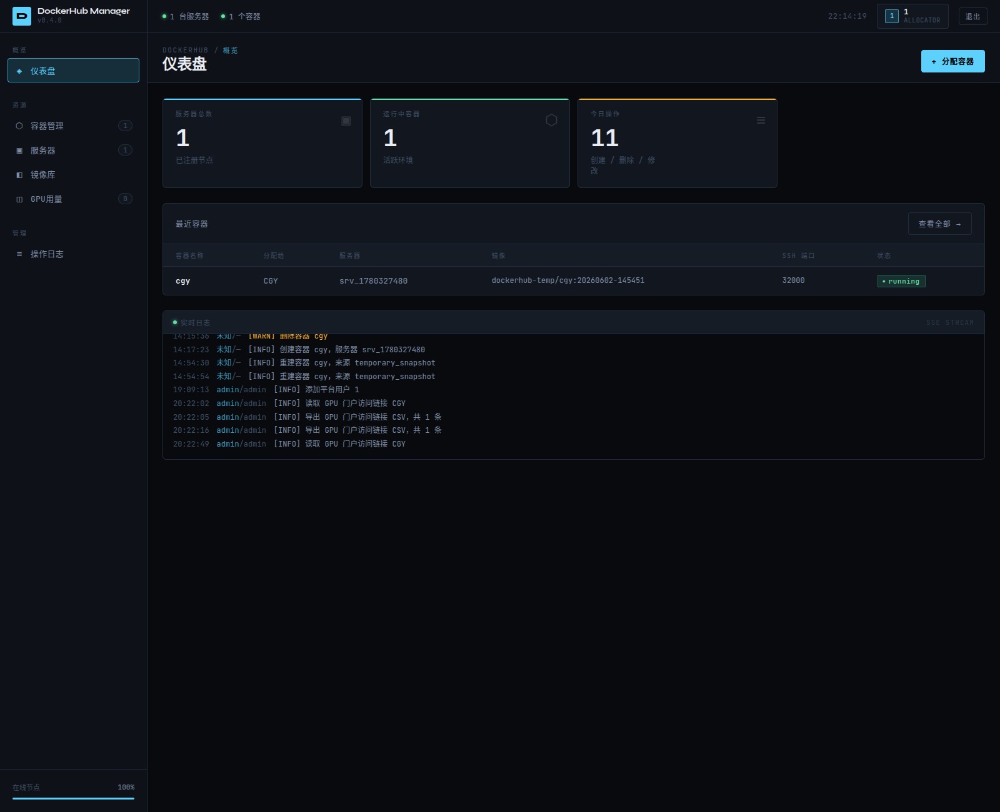

建议先熟悉左侧 6 个主要入口：

1. 仪表盘
2. 容器管理
3. 服务器
4. 镜像库
5. GPU 计算时
6. 操作日志

## 网页端主要栏目

### 1. 仪表盘

用于每日快速巡检：

1. 服务器总数与在线状态。
2. 容器总数与概览。
3. 当前整体运行情况。

日常先看这里，重点确认：

1. 左上角在线节点是否正常。
2. 服务器总数、运行中容器是否符合预期。
3. 最近容器和实时日志里是否有明显异常。

### 2. 服务器管理

用于：

1. 添加服务器。
2. 编辑服务器配置。
3. 查看 Agent 在线状态。
4. 查看挂载根目录和能力检查结果。

重点关注：

1. Agent 是否在线。
2. GPU 是否可用。
3. 可写层磁盘限额是否支持。
4. 挂载目录是否正确。

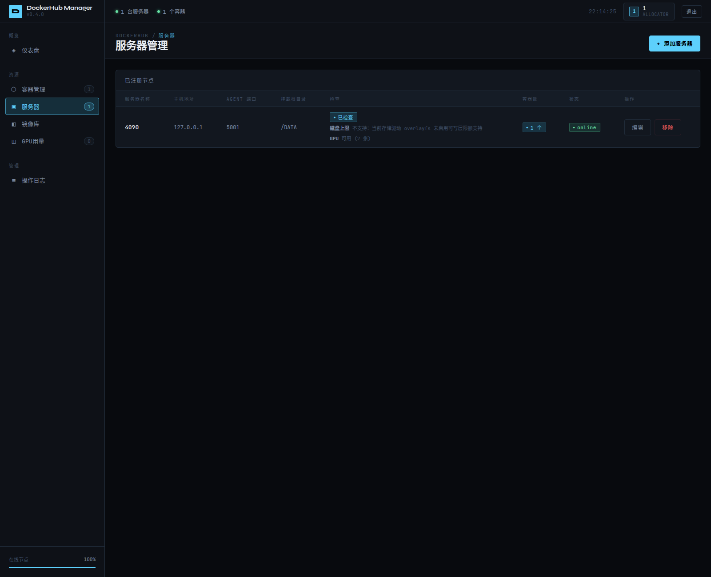

### 3. 容器管理

这是分配员最常用的页面。

可以完成：

1. 创建容器。
2. 按服务器或使用者标识筛选容器。
3. 查看 SSH 登录命令。
4. 查看端口映射。
5. 查看 CPU / 内存 / PIDs / 磁盘 / GPU 占用。
6. 在线修改资源。
7. 备份镜像。
8. 重建容器。
9. 删除容器。

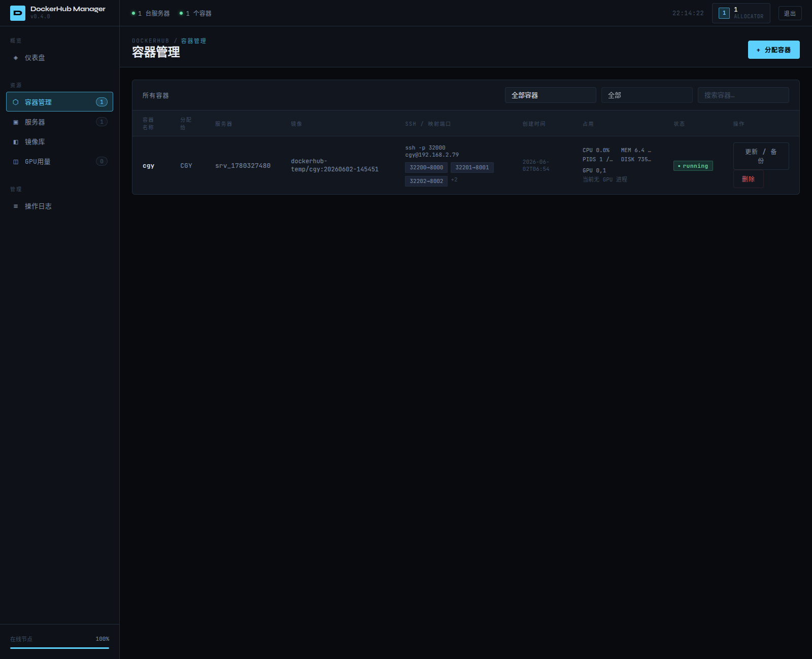

页面里重点看 3 块：

1. `SSH / 映射端口`
2. `占用`
3. `更新 / 备份`

### 4. 镜像库

用于：

1. 拉取镜像。
2. 查看手动备份镜像。
3. 删除无用旧镜像。

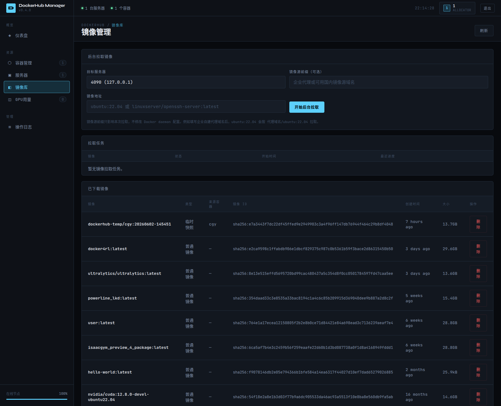

### 5. GPU 计算时

用于：

1. 查看本周用量与有效额度。
2. 查看最近 30 天排行。
3. 查看单用户最近 30 天曲线。
4. 调整基础额度和临时额度。
5. 发放或重置门户访问链接。

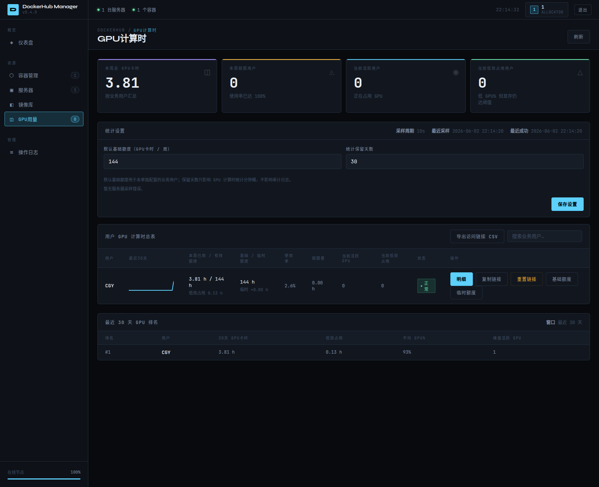

### 6. 操作日志

用于：

1. 追踪谁执行了什么操作。
2. 回看失败记录。
3. 辅助排查容器、额度、镜像相关问题。

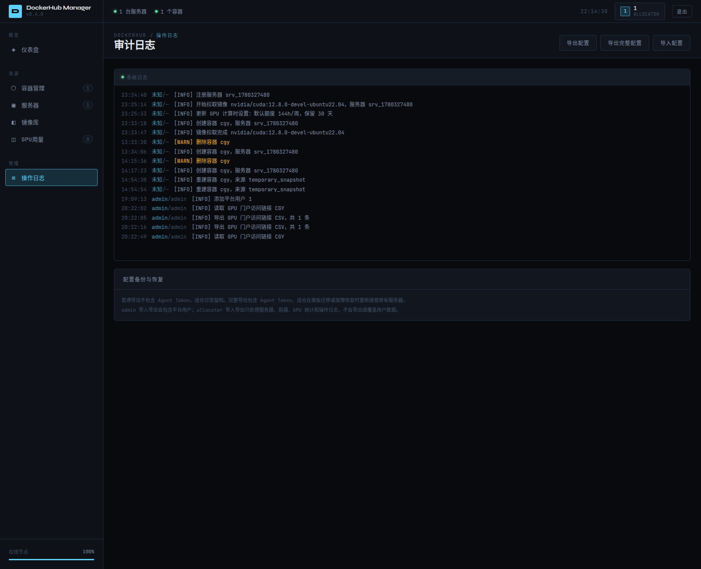

## 常用操作流程

## 添加服务器

标准流程：

1. 确认目标宿主机已部署 Agent。
2. 在服务器管理中填写主机地址、端口、Token。
3. 配置挂载根目录。
4. 保存后立即检查状态与能力。

操作入口：

1. 打开左侧 `服务器`
2. 点击右上角 `+ 添加服务器`

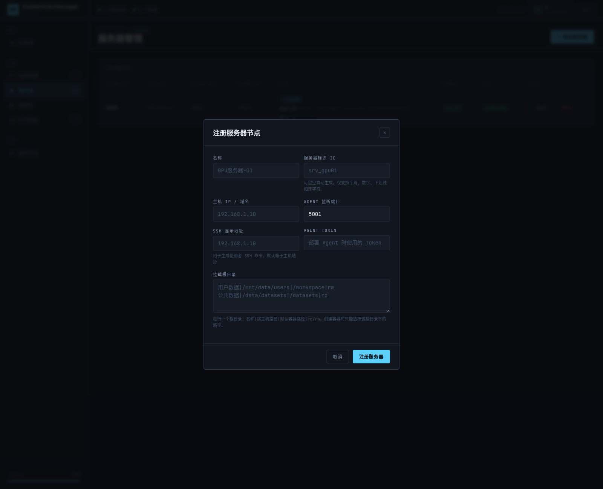

填写时重点注意：

1. `名称` 用于页面识别。
2. `服务器标识 ID` 建议固定，不要频繁改。
3. `主机 IP / 域名` 与 `Agent 监听端口` 要和实际 Agent 一致。
4. `SSH 显示地址` 是给使用者看的登录地址。
5. `挂载根目录` 决定容器可选挂载范围。

至少确认：

1. 服务器显示在线。
2. 挂载目录检查通过。
3. GPU 状态符合预期。
4. 如需磁盘限额，服务器显示支持。

## 分配新容器

标准流程：

1. 选择目标服务器。
2. 选择镜像。
3. 填写使用者标识。
4. 填写容器登录用户。
5. 设置 CPU、内存、PIDs、磁盘上限。
6. 按需启用 GPU。
7. 确认额外业务端口数量。
8. 创建后立即核对 SSH 命令、端口映射和运行状态。

操作入口：

1. 在仪表盘或容器管理页点击 `+ 分配容器`

建议按下面顺序填写：

1. 先选目标服务器。
2. 再选镜像。
3. 再填使用者标识和登录用户。
4. 再决定 CPU / 内存 / PIDs / 可写层磁盘上限。
5. 如需 GPU，再勾选并确认设备。
6. 最后检查 SSH 端口、网络模式、额外业务端口和挂载目录。

创建后立即核对：

1. 容器状态是否为 `running`
2. SSH 命令是否可复制
3. 端口映射是否符合预期
4. 占用栏是否开始正常刷新

!!! tip "使用者标识"
    GPU 统计、额度和跨服务器同名用户聚合优先按“使用者标识”进行。  
    同一实际用户应尽量保持同一个使用者标识，不要随意变更。

## 在线修改资源

适用范围：

1. CPU
2. 内存
3. PIDs
4. 可写层磁盘上限（仅在服务器支持时）

建议做法：

1. 先看当前占用，再决定调整幅度。
2. 小幅度调整优先在线修改。
3. 修改后刷新确认是否生效。

标准做法：

1. 先在容器管理页确认当前占用。
2. 点击 `更新 / 备份`。
3. 小改 CPU / 内存 / PIDs 时优先走在线修改。
4. 涉及 GPU、磁盘上限、运行参数、端口映射时再走重建。

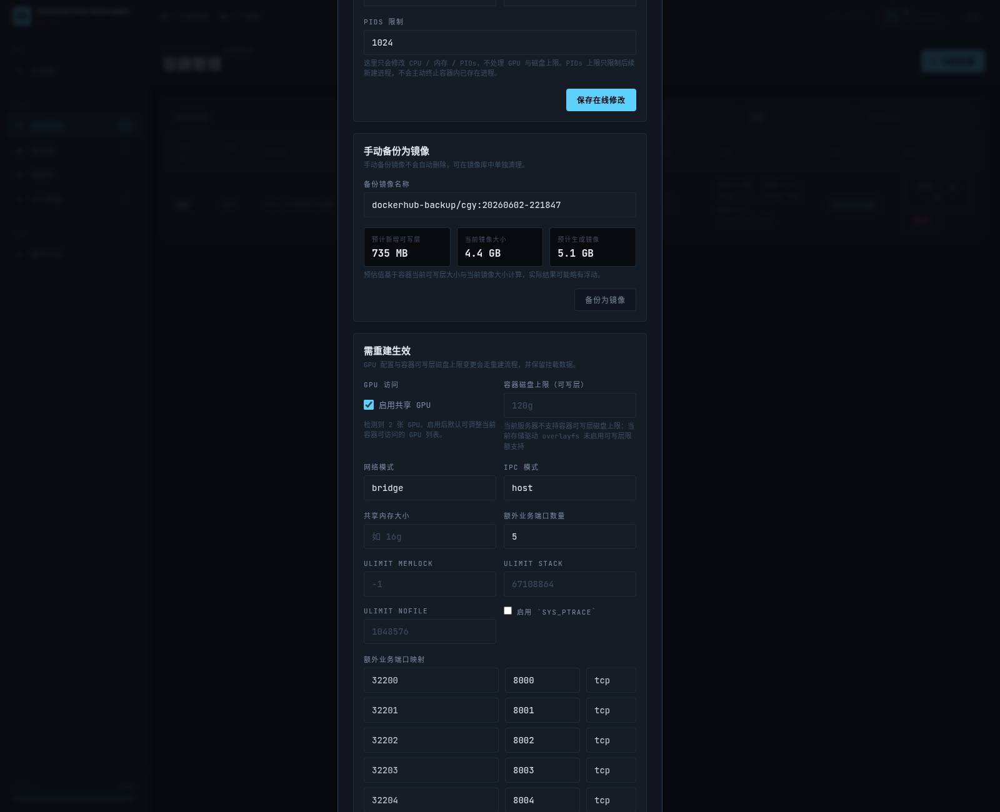

## 备份与重建

适用场景：

1. 用户环境需要保留。
2. 准备重建前需要可回退镜像。
3. 需要从已有备份恢复。

应区分：

1. 临时快照镜像
- 主要服务于重建流程。

2. 手动备份镜像
- 用于长期保留，不应自动删除。

执行前建议确认：

1. 用户数据是否都在挂载目录。
2. 当前是否需要先手动备份。
3. 端口、GPU、运行参数是否要一起调整。

## 删除容器

删除前至少确认：

1. 用户是否仍在使用。
2. 数据是否已保存在挂载目录。
3. 是否需要先手动备份镜像。

## 日常维护规范

## 每日巡检

建议每天至少检查一次：

1. 服务器在线状态。
2. 容器是否有 `missing`、异常占用或明显状态异常。
3. GPU 超额用户。
4. 低效占用 GPU 用户。
5. 最近失败的操作日志。

推荐巡检顺序：

1. 先看仪表盘。
2. 再看服务器是否在线。
3. 再看容器管理里的状态和占用。
4. 再看 GPU 计算时里是否有异常用户。
5. 最后看操作日志确认是否有失败操作。

## 每周维护

建议每周至少做一次：

1. 回顾本周 GPU 超额用户。
2. 评估是否需要调高基础额度或只发放临时额度。
3. 清理已确认无用的旧镜像。
4. 导出一次配置。

配置导入导出入口在 `操作日志` 页面右上角。

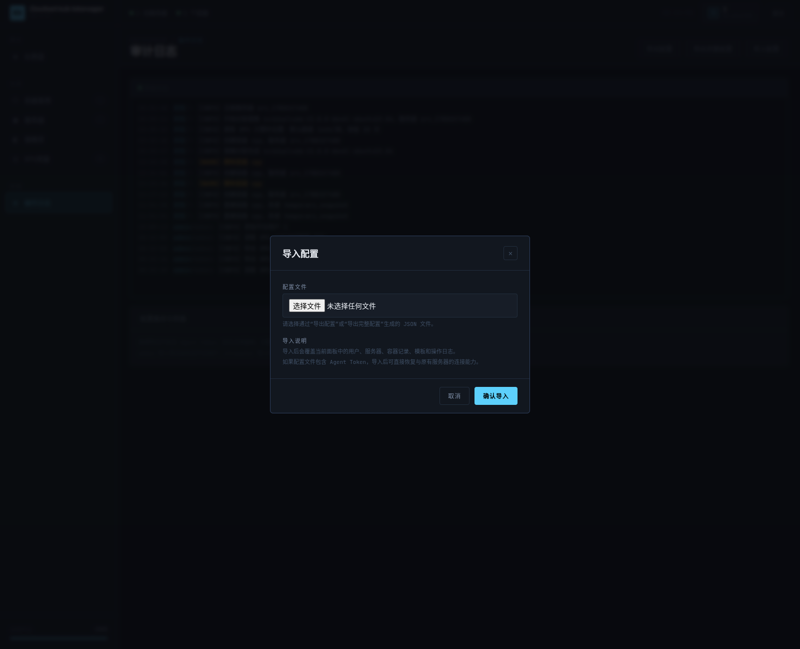

说明：

1. 日常留档优先导出普通配置。
2. 需要完整接管服务器时再导出完整配置。
3. 导入前必须先确认当前面板数据允许被覆盖。

## 额度管理建议

### 基础额度适用于

1. 长期稳定的资源需求变化。
2. 某类用户持续更高负载。

### 临时额度适用于

1. 某个训练周期。
2. 某次短期项目冲刺。
3. 某段时间的集中实验。

!!! note "简单原则"
    长期需求改基础额度。  
    短期需求加临时额度。  
    临时任务结束后及时复核是否需要恢复默认。

在 `GPU计算时` 页面里：

1. 上半部分改全局默认基础额度和统计保留天数。
2. 中间用户表看本周已用 / 有效额度、超额量和当前活跃 GPU。
3. 用户操作列可做 `明细`、`复制链接`、`重置链接`、`基础额度`、`临时额度`。

用户明细示例：

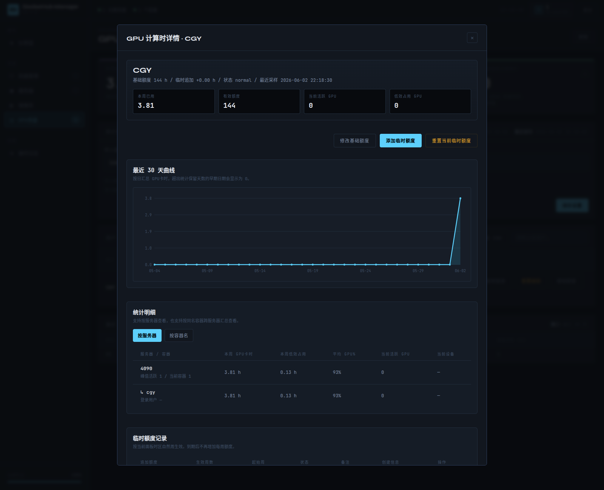

基础额度弹窗：

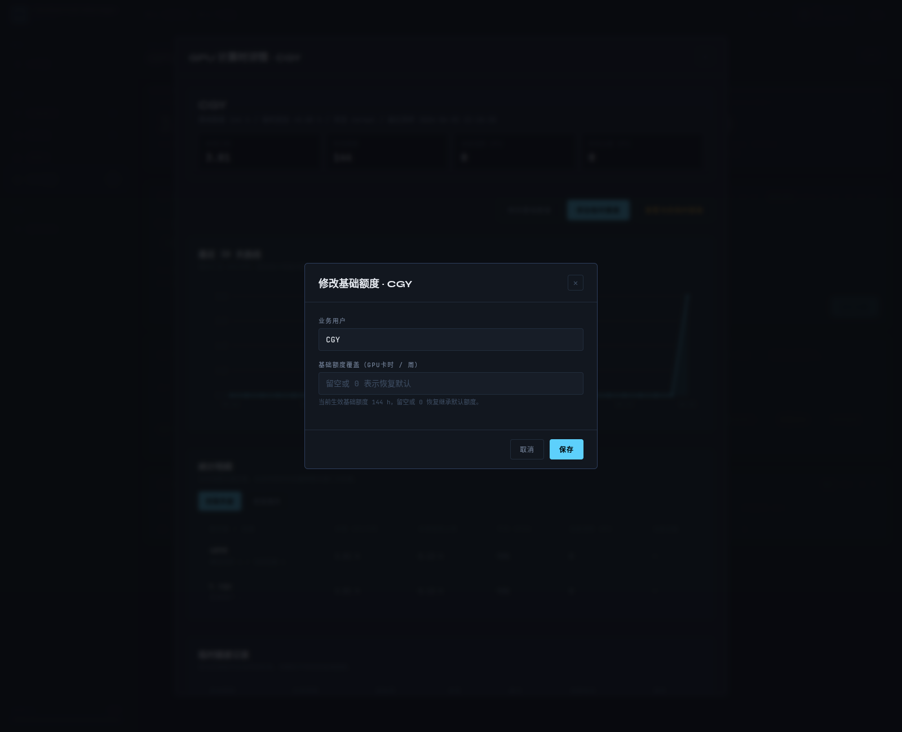

临时额度弹窗：

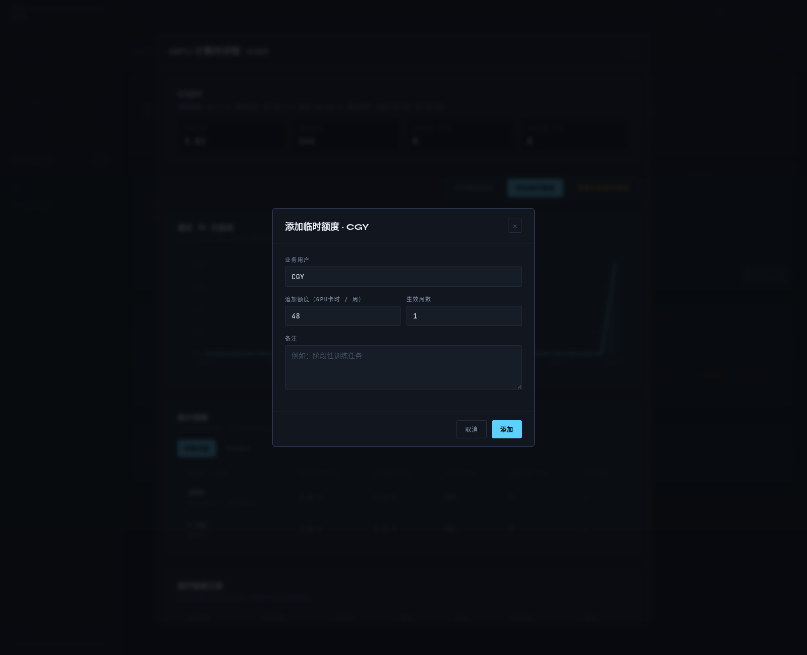

## 常见问题处理

## 容器创建失败

优先检查：

1. 目标服务器是否在线。
2. 镜像是否存在。
3. 端口是否冲突。
4. Docker / Agent 是否正常。
5. 操作日志是否有明确错误信息。

## 容器已创建但面板未识别

排查顺序：

1. 刷新容器管理页。
2. 检查 Agent 能否读取容器列表。
3. 查看是否已有同名记录冲突。
4. 必要时走接管或重建流程。

## GPU 不可用

优先检查：

1. 服务器能力检查是否显示 GPU 支持。
2. 分配时是否启用了 GPU。
3. 镜像环境是否满足 CUDA 使用需求。
4. 宿主机驱动或 NVIDIA 运行时是否异常。

## SSH 登录异常

优先检查：

1. SSH 命令是否正确。
2. 容器是否处于运行状态。
3. SSH 端口映射是否存在。
4. 用户密码或公钥是否按预期配置。

## 工作节奏建议

建议形成固定节奏：

1. 每天看运行状态、容器异常和 GPU 超额。
2. 每周做额度复核与镜像清理。
3. 每月复核整体资源策略和热点用户情况。

这样分配员不会总是在问题爆发后被动处理。
