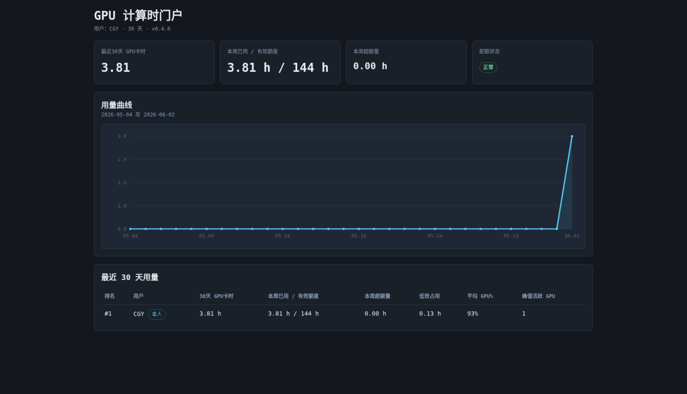
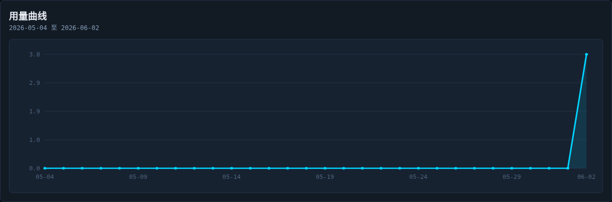
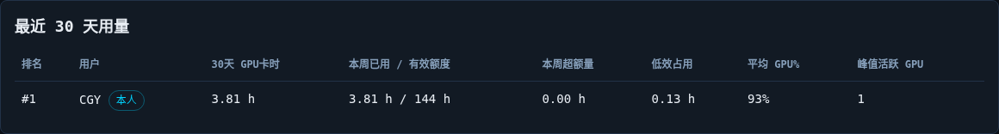

# GPU 用量说明

## 适用对象

适用于：

1. 分配员。
2. 需要查看自己 GPU 用量的普通用户。

## 页面总览

GPU 计算时页面会集中展示：

1. 本周已用。
2. 有效额度。
3. 本周超额量。
4. 最近 30 天 GPU 卡时排行。
5. 每个用户的最近 30 天曲线入口。


## 平台当前统计的是什么

平台统计的是 GPU 实际计算占用情况，而不是简单的“容器看见了几张卡”。

统计重点包括：

1. GPU 卡时。
2. 低效占用卡时。
3. 当前活跃 GPU 数量。
4. 最近 30 天用量排行。
5. 单用户最近 30 天曲线。

## 用户统计口径

当前用户聚合口径优先按：

1. 使用者标识

如果某个容器没有使用者标识，才会退回到：

1. 容器登录用户

因此对分配员来说：

1. 同一实际用户应尽量保持同一个使用者标识。

## 本周已用 / 有效额度

例如你看到：

```text
2.36 h / 144 h
```

含义是：

1. `2.36 h`
- 本周已经累计使用的 GPU 卡时。

2. `144 h`
- 当前生效的本周有效额度。

有效额度通常由两部分组成：

1. 基础额度
2. 临时额度

在列表页里，这个字段通常会直接显示成：

```text
本周已用 / 有效额度
```

因此管理员和用户都能快速判断当前是否接近上限。

## 本周超额量

如果本周已用超过有效额度，就会出现超额量。

例如：

```text
本周已用 150 h
有效额度 144 h
本周超额量 6 h
```

如果未超过额度，则超额量为 `0 h`。

## 最近 30 天用量

最近 30 天排行表示的是：

1. 按最近 30 天累计 GPU 卡时排序。

但需要注意：

1. 排行中的“30天 GPU卡时”是 30 天窗口统计。
2. 其中展示的“本周已用 / 有效额度”和“本周超额量”仍然按本周口径计算。

这两种口径不要混淆。

你可以把它理解成：

1. 排行是一个 30 天窗口的横向比较。
2. 额度和超额量是一个本周窗口的纵向约束。

## 低效占用

低效占用大致表示：

1. GPU 利用率不高，
2. 但显存仍然处于明显占用状态，
3. 并且持续达到统计条件。

这通常意味着：

1. 任务空跑。
2. 程序挂起但未退出。
3. 使用方式不够合理。

对分配员来说，这是需要重点关注的信号。

## 单用户详情页

管理员可以点开某个用户的详情，查看：

1. 最近 30 天每日曲线。
2. 本周已用、有效额度、超额量。
3. 按服务器统计。
4. 按容器统计。
5. 临时额度记录。


详情页适合回答这些问题：

1. 某个用户最近是不是突然暴涨。
2. 用量主要集中在哪台服务器。
3. 是哪几个容器贡献了主要卡时。
4. 临时额度是否已经覆盖当前需求。

## 对外门户

对外门户一般使用专属链接访问。

门户中：

1. 用户本人可看到自己的完整数据。
2. 其他用户仅显示脱敏名。
3. 门户是只读页面，不提供管理操作。

门户适合：

1. 用户自行查看用量变化。
2. 分配员减少重复答疑。

门户和后台管理页看的核心口径一致，但权限不同：

1. 门户是只读。
2. 后台可以调额度、重置链接、导出 CSV。
3. 门户中其他用户会做脱敏显示。

真实门户页面如下：



如果只看趋势，最关键的是曲线区：



如果只看横向比较，最关键的是最近 30 天排行：



因此可以这样分工：

1. 用户平时主要看门户。
2. 分配员处理额度、排查异常时看后台管理页。
3. 两边看到的核心统计口径保持一致。

## 基础额度

基础额度适合长期、稳定的需求。

常见场景：

1. 某个课题组成员长期每周都需要较高训练时长。
2. 某个用户长期承担持续推理或调参工作。

管理员可以在基础额度弹窗中覆盖默认值：


建议：

1. 长期稳定需求用基础额度解决。
2. 不要把长期需求一直靠临时额度硬撑。

## 临时额度如何理解

临时额度适合短期突发需求，例如：

1. 近期要集中跑实验。
2. 临近汇报或论文截稿。
3. 临时借用更多 GPU 时间。

管理员可以设置：

1. 临时额度大小。
2. 生效周数。
3. 随时重置为 0。


因此有效额度可以理解为：

```text
有效额度 = 基础额度 + 当前仍在生效期内的临时额度
```

## 分配员如何使用这些数据

建议重点关注：

1. 本周已明显超额的用户。
2. 最近 30 天排行长期靠前的用户。
3. 长时间低效占用 GPU 的用户。
4. 短期集中高负载、但有正当需求的用户。

处理方式通常有两类：

1. 长期需求调整基础额度。
2. 短期需求发放临时额度。

实际工作里，建议每周至少做一次检查：

1. 看本周超额用户。
2. 看最近 30 天排行前列用户。
3. 看是否存在长期低效占用。
4. 对确有需要的用户补临时额度或调整基础额度。

## 普通用户如何理解这些数据

普通用户主要关心：

1. 自己本周用了多少。
2. 是否接近额度上限。
3. 最近 30 天用量变化是否正常。

如果发现自己近期需要明显更多 GPU 资源，应尽早联系分配员，不要等到超额后再处理。

## 一句话总结

如果你是普通用户，重点看：

1. 本周已用。
2. 有效额度。
3. 最近 30 天趋势。

如果你是分配员，重点再加上：

1. 排行。
2. 低效占用。
3. 基础额度与临时额度是否合理。
